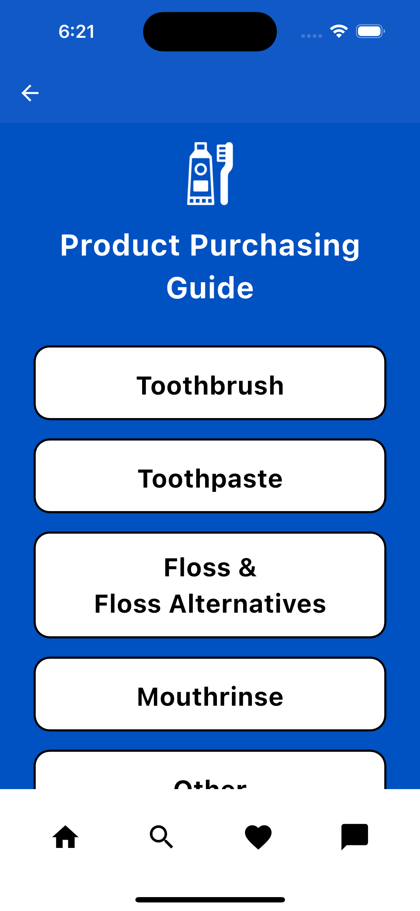

# 🦷 BrightBite

> Empowering patients with accessible dental health education

[](https://flutter.dev)
[](https://dart.dev)
[](https://opensource.org/licenses/MIT)

## 📋 Table of Contents
* [About the Project](#about-the-project)
* [Key Features](#key-features)
* [Technology Stack](#technology-stack)
* [Getting Started](#getting-started)
  * [Prerequisites](#prerequisites)
  * [Installation](#installation)
  * [Running the App](#running-the-app)
  * [Building for Production](#building-for-production)
* [Project Structure](#project-structure)
* [Screenshots](#screenshots)
* [User Testing & Feedback](#user-testing--feedback)
* [Contributing](#contributing)
* [Team](#team)
* [Future Roadmap](#future-roadmap)
* [Project Status](#project-status)
* [Legal Information](#legal-information)
* [Documentation](#documentation)
* [Contact](#contact)
* [Acknowledgments](#acknowledgments)

## About the Project

**BrightBite** is an educational dental application built with Flutter that bridges the gap between professional dental care and home oral health management. Created by a Registered Dental Hygienist with 12 years of experience, the app provides vetted educational resources and specific product recommendations from dental professionals.

### Mission Statement
BrightBite bridges the gap between professional dental care and home oral health management by providing vetted educational resources and product recommendations from dental professionals, making oral healthcare more accessible and reducing treatment anxiety.

### Problem Statement
Many patients struggle with understanding dental procedures and proper oral hygiene techniques due to:
- Limited appointment time with dental professionals
- Overwhelming product choices without expert guidance
- Dental anxiety due to lack of information
- Miscommunication or misunderstanding of home care instructions
- Constantly changing dental industry knowledge

### Solution
BrightBite offers:
- Educational content created and verified by dental professionals
- Specific product recommendations from practicing dental hygienists
- Treatment explanations that reduce dental anxiety
- Accessible information between professional visits
- Expert guidance for oral healthcare in a convenient mobile format

### Project Origin
This app was conceived by Whitney Haddad, a Registered Dental Hygienist with 12 years of experience (plus 4 years as a dental assistant). Recognizing the challenge of providing comprehensive information during limited appointment times, Whitney envisioned a reliable resource for patients to reference after leaving the treatment chair. The app addresses the common challenges of patient education, product recommendation, and treatment understanding that dental professionals face daily.

## 🌟 Key Features

### Core Functionality
- **📚 Smile Academy**: Comprehensive educational hub with categorized content
  - **Oral Hygiene**: How to brush properly, flossing techniques, floss alternatives, tongue cleaning
  - **Dental Treatment**: 
    - Preventive care
    - Composite fillings
    - Crowns
    - Extractions
    - Other treatments (veneers, teeth whitening, dentures, partials, implants, root canals, orthodontics)
  - **Life Stages**: 
    - Infants
    - Children and teens
    - Adults
    - Seniors
  
- **🛒 Product Purchasing Guide**: Complete expert shopping guide
  - **Toothbrushes**: Manual and electric options with professional recommendations
  - **Floss and Floss Alternatives**: Traditional floss, water flossers, interdental brushes
  - **Mouthrinse**: Therapeutic and cosmetic options for different needs
  - **Other Products**: Specialized oral care tools and accessories

### Interactive Features
- **📹 Educational Videos**: Professionally vetted videos embedded within relevant topics
- **🔗 Direct Purchase Links**: Easy access to buy recommended products
- **⭐ Favorites System**: Save preferred topics for quick future reference
- **👍 Professional Verification**: All content and product recommendations verified by Whitney Haddad, RDH
- **📱 Intuitive Navigation**: User-friendly interface with clear content organization

### Why BrightBite is Unique
- Created by a Registered Dental Hygienist with 12+ years of clinical experience
- Bridges the gap between professional dental visits and daily home care
- Reduces dental anxiety through educational content
- Eliminates confusion with specific product recommendations
- Provides trusted information that reflects current industry standards

## 🛠️ Technology Stack

| Component | Technology | Purpose |
|-----------|------------|---------|
| **Frontend** | Flutter/Dart | Cross-platform UI development |
| **Design** | Figma | UI/UX design and prototyping |
| **Version Control** | Git/GitHub | Code management and collaboration |
| **Local Storage** | Hive/Hive Flutter | Offline data and favorites system |
| **Web Integration** | WebView Flutter | Displaying web content and purchase links |
| **Video Content** | YouTube Player Flutter | Embedded educational videos |
| **External Links** | URL Launcher | Opening product purchase links |
| **Development** | VS Code, Android Studio, Xcode | Development and testing environments |

## 🚀 Getting Started

### Prerequisites

Before you begin, ensure you have the following installed:

```bash
# Check Flutter installation
flutter doctor

# Required:
- Flutter SDK (3.2.3 or higher)
- Dart SDK (3.2.3 or higher)
- Android Studio or Xcode
- Git
```

### Installation

1. **Clone the repository**
   ```bash
   git clone https://github.com/rileymck/BrightBite.git
   cd brightbite
   ```

2. **Install dependencies**
   ```bash
   flutter pub get
   ```

3. **Set up environment**
   ```bash
   # Copy environment template
   cp .env.example .env
   # Edit .env with your configuration
   ```

### Running the App

#### Development Mode
```bash
# Run on default device
flutter run

# Run on specific device
flutter devices
flutter run -d [device-id]
```

#### Hot Reload
While the app is running, press `r` to hot reload changes.

### Building for Production

#### Android
```bash
# Generate APK
flutter build apk --release

# Generate App Bundle (recommended for Play Store)
flutter build appbundle --release
```

#### iOS
```bash
# Build for iOS
flutter build ios --release
# Open in Xcode for distribution
open ios/Runner.xcworkspace
```

## 📁 Project Structure

```
brightbite/
├── lib/
│   ├── main.dart              # Application entry point
│   ├── app.dart               # App configuration
│   ├── pages/                 # Screen components
│   │   ├── home/
│   │   ├── smile_academy/
│   │   ├── product_guide/
│   │   └── profile/
│   ├── components/            # Reusable widgets
│   │   ├── cards/
│   │   ├── navigation/
│   │   └── buttons/
│   ├── models/                # Data models with Hive integration
│   │   ├── user.dart
│   │   ├── article.dart
│   │   └── product.dart
│   ├── services/              # Business logic
│   │   ├── content_service.dart
│   │   └── storage_service.dart
│   └── utils/                 # Helper functions
├── assets/
│   ├── images/                # 30+ dental and UI images
│   │   ├── brightbitelogo.png
│   │   ├── toothbrush.png
│   │   └── ...
│   ├── fonts/                 # PT Serif font family
│   │   ├── PTSerif-Bold.ttf
│   │   ├── PTSerif-Regular.ttf
│   │   └── ...
│   └── ic_launcher.png        # App icon
├── test/                      # Test files
├── docs/                      # Documentation
└── pubspec.yaml               # Project dependencies
```

## 📱 Screenshots

<div align="center">
  
  <p><i>BrightBite product poster showcasing key features and interface</i></p>
</div>

<div align="center">
  <p><b>App Interface</b></p>
  <table>
    <tr>
      <td></td>
      <td></td>
      <td></td>
    </tr>
    <tr>
      <td></td>
      <td></td>
      <td></td>
    </tr>
    <tr>
      <td></td>
      <td></td>
      <td></td>
    </tr>
  </table>
</div>

### Key Interface Features

- **Clean Blue Design**: Professional dental-themed color scheme
- **Intuitive Navigation**: Simple, accessible menus and clear pathways
- **Educational Videos**: Embedded YouTube tutorials with professional guidance
- **Product Recommendations**: Vetted dental products with descriptions
- **Bookmark Feature**: Save favorite content for easy reference (upper right icon)

## 🧪 User Testing & Feedback

### Testing Methodology
- Usability testing with dental patients
- Interface testing across multiple devices
- Terminology comprehension evaluation
- Navigation flow assessment

### Key Feedback Implemented

#### Terminology Simplification
**Feedback Received:**
The term "Interdental Aids" was confusing to users. Most didn't understand what it meant.

**What We Changed:**
We renamed it to "Floss Alternatives" to make it more clear and user-friendly.

**Why It Matters:**
This change helps users — especially non-dental professionals — quickly understand the purpose of the section without needing extra explanation.

#### Additional Improvements
- Reorganized content categories based on user navigation patterns
- Enhanced product descriptions with clearer benefits
- Added step-by-step instructions for techniques
- Improved video descriptions for better context

### User-Centered Design Approach
Our development process incorporated continuous feedback loops, allowing us to refine the application based on real user experiences. This iterative approach helped ensure that BrightBite remains accessible to users without dental backgrounds while still providing accurate, professional information.

## 🤝 Contributing

We welcome contributions to BrightBite! Please follow these steps to contribute:

1. Fork the repository
2. Create a feature branch (`git checkout -b feature/AmazingFeature`)
3. Commit your changes (`git commit -m 'Add AmazingFeature'`)
4. Push to the branch (`git push origin feature/AmazingFeature`)
5. Open a Pull Request

### Development Workflow
- Use the project's code style guidelines
- Add appropriate comments for complex functionality
- Ensure cross-platform compatibility
- Test on both iOS and Android devices

## 👥 Team

### Core Development Team
- **Whitney Haddad, RDH** - Project Lead, Dental Professional & Content Lead, UI implementation welcome screen and main landing pages, Assets Integration, Implementation of Disclaimer page, Added images, hyperlinks, and descriptions to manual toothbrush product page.
- **Elicia Perez** - Product and Educational Research, UI Implementation for Treatment Page and toothbrush and mouthrinse product pages.
- **Riley Mckenzie** - GitHub Management & Hive Favorites Feature
- **Shukria Gulzar** - Figma Design, UI Implementation for Product Guide Pages Floss & Floss Alternatives and Toothpaste
- **Yun Chang** - Scrum Board Setup, UI Development for Smile Academy pages.
- **Zaid Alhamdran** - Video Content Research, YouTube Integration

### Development Roles

#### Design & UX Research
- **Shukria Gulzar and Whitney Haddad**:
  - Figma screen layouts and prototypes
  - UI/UX accessibility research
  - Color contrast optimization

#### Content Development
- **Elicia Perez** - Dental health educational research
- **Zaid Alhamdran** - Educational video content curation
- **Whitney Haddad, RDH** - Professional content verification

#### Technical Implementation
- **Riley Mckenzie** - GitHub management, Hive database implementation for Favorites function.
- **Yun Chang** - UI Smile Academy pages.
- **Elicia Perez** - UI Product Guide toothbrush and mouthrinse and Smile Academy Treatment pages
- **Shukria Gulzar** - UI for Toothpaste and floss & floss alternatives product pages
- **Zaid Alhamdran** - YouTube video embedding for "How to brush, How to floss, and how to clean your tongue."
- **Whitney Haddad** - Welcome/main landing pages for Smile Academy and Product Purchasing Guide pages, Implementing hyperlinks, images, and decriptions to the manual toothbrush product page, image assets, overall troubleshooting.

### Acknowledgments
- Professor Jody Paul
- Beta testers

## 🚀 Future Roadmap

### Unfinished Features
- [ ] **Enhanced Product Guide**: More interactive product images with direct purchasing links
- [ ] **Additional Educational Videos**: Expanding embedded video content within relevant pages

### Planned Enhancements
- [ ] **Search Functionality**: Keyword search to quickly locate specific content
- [ ] **Dental Chatbot**: AI assistant drawing from reliable dental resources to answer user questions
- [ ] **App Store Deployment**: Publishing to iOS App Store and Google Play Store (requires developer accounts)
- [ ] **Multi-language Support**: Spanish language priority for broader accessibility
- [ ] **Interactive Tutorials**: Guided walkthroughs for brushing and flossing techniques

### Vision for Growth
BrightBite aims to become the definitive mobile resource for dental education, recognized and recommended by dental professionals nationwide as a trusted patient resource.

## 📋 Project Status

This application was developed as a senior project for Computer Science at MSU Denver. The current version represents a functional prototype that demonstrates the core features and capabilities of the BrightBite concept.

### Current Implementation
- ✅ Complete educational content structure
- ✅ Product purchasing guide with professional recommendations
- ✅ Embedded educational videos
- ✅ Favorites system for content bookmarking
- ✅ Cross-platform implementation (iOS/Android)

### Limitations
- 📱 Not yet published on app stores (requires developer accounts)
- 🔍 Search functionality planned but not implemented
- 💬 AI chatbot feature planned for future release

### Academic Context
This project demonstrates the application of software engineering principles, Flutter/Dart development skills, and interdisciplinary collaboration between technical developers and dental healthcare professionals. As a senior project, it fulfills requirements for demonstrating:

- Full-stack mobile application development
- User-centered design and implementation
- Professional documentation standards
- Real-world problem-solving through technology

## 📝 Legal Information

### Disclaimer
This application includes a disclaimer that users must acknowledge when first launching the app:

```
The information, content, and videos provided in this app are for educational purposes only and do not constitute medical or dental advice. We are not promoting or advertising any specific products, brands, or channels.

All content has been reviewed and suggested by Whitney Haddad RDH, a licensed dental hygienist with over 10 years of experience, to help you better understand and improve your oral health. However, this content should not be used as a substitute for professional dental or medical care. Always consult with your dentist or healthcare provider regarding any dental or oral health concerns.

The creators, developers, and contributors of this app assume no liability or responsibility for any injury, loss, or damage incurred as a result of any use or reliance upon the information and material contained within it. By using this app, you acknowledge and agree that any actions you take based on the information provided are at your own risk.

This app requires an internet connection to function properly. Some features, particularly videos, may be limited or unavailable without internet connectivity.

Videos are connected to YouTube, and we are not affiliated with any of the creators or any advertisements that may appear on these videos. These videos were included strictly as additional educational content. At the time of selection, all videos were vetted for reliable information that we believed would be valuable to our users. However, video content may change over time, and we cannot guarantee the continued accuracy or appropriateness of linked content.
```

### Educational Purpose
BrightBite is designed for educational purposes only and should not replace professional dental consultation. While content is professionally reviewed, individual needs vary, and users should consult their dental providers for personalized advice.

## 📚 Documentation

For detailed documentation, please visit:
- [Full Documentation](docs/DOCUMENTATION.md)
- [User Guide](docs/USER_GUIDE.md)
- [Development Guide](docs/DEVELOPMENT_GUIDE.md)

### Key Packages Documentation

- [Hive Database](https://docs.hivedb.dev/) - Local storage solution
- [WebView Flutter](https://pub.dev/packages/webview_flutter) - For embedded web content
- [YouTube Player Flutter](https://pub.dev/packages/youtube_player_flutter) - For video tutorials
- [Photo View](https://pub.dev/packages/photo_view) - For image zoom/pan features

## 📞 Contact

For questions or support, please contact:
- Project Link: [https://github.com/rileymck/BrightBite](https://github.com/rileymck/BrightBite)

## 🙏 Acknowledgments

Special thanks to:
- Course instructor: Jody Paul
- All beta testers who provided valuable feedback

---

<div align="center">
  Made with ❤️ by the BrightBite Team
</div>
